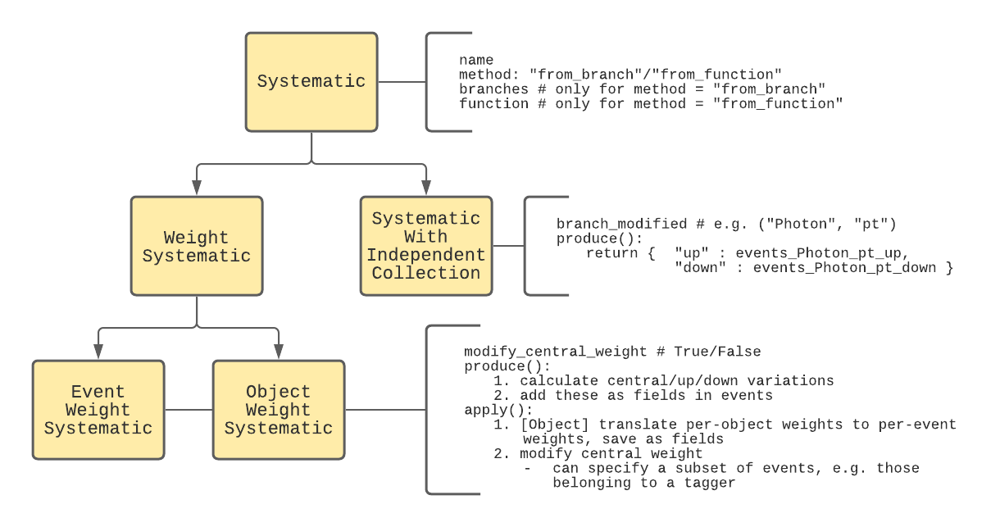
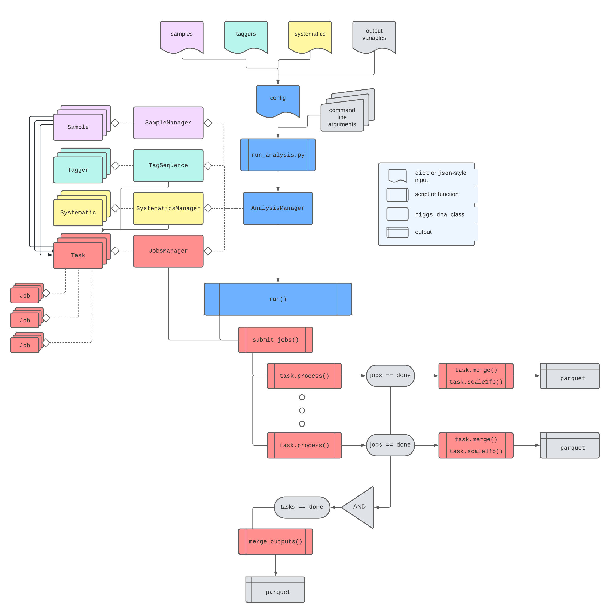
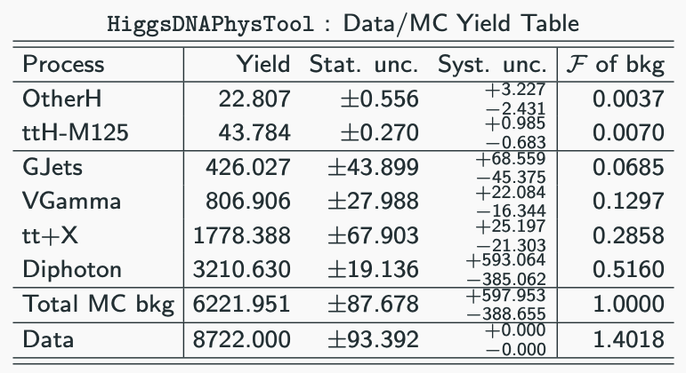
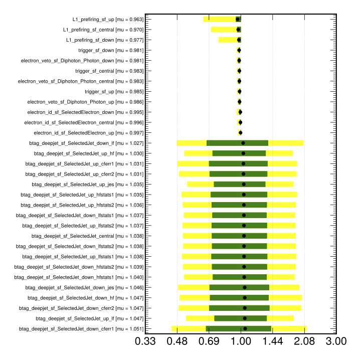
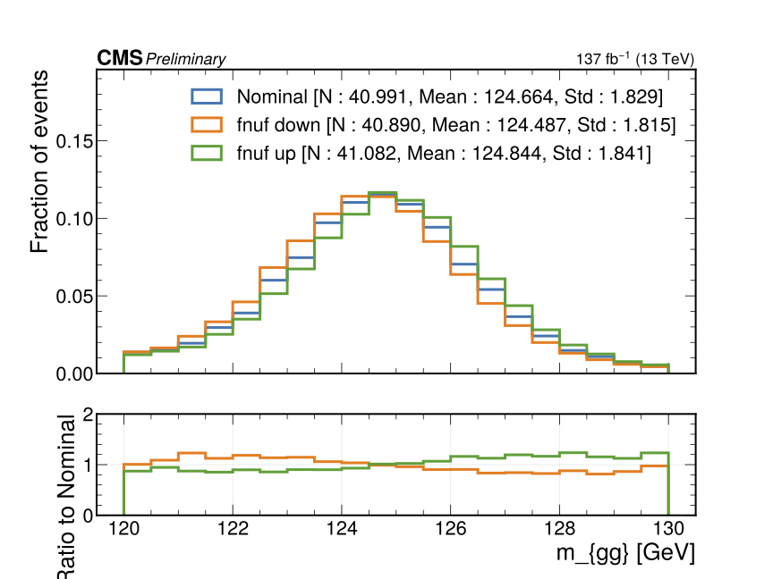
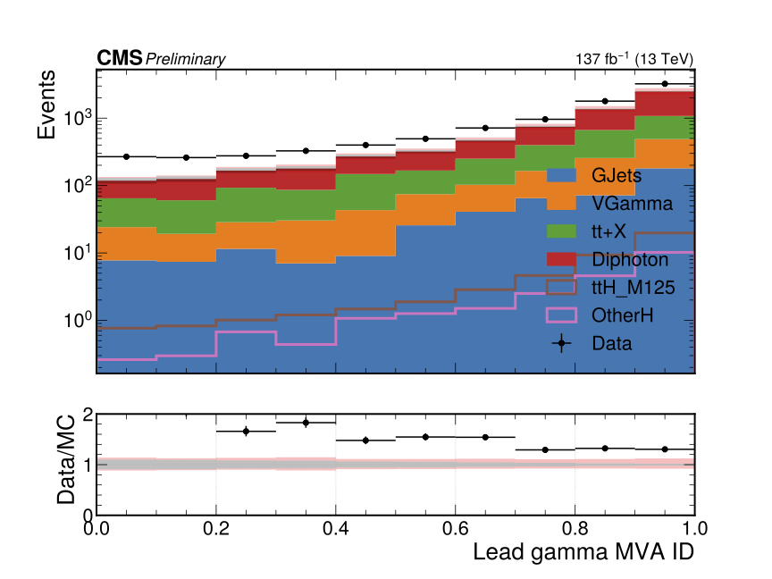
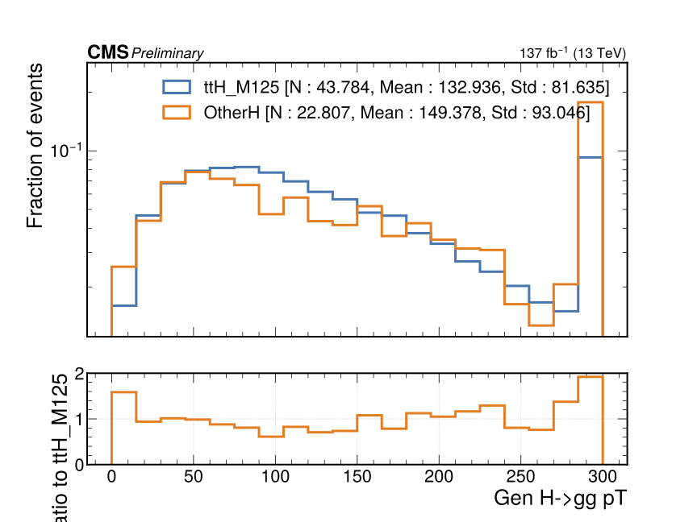
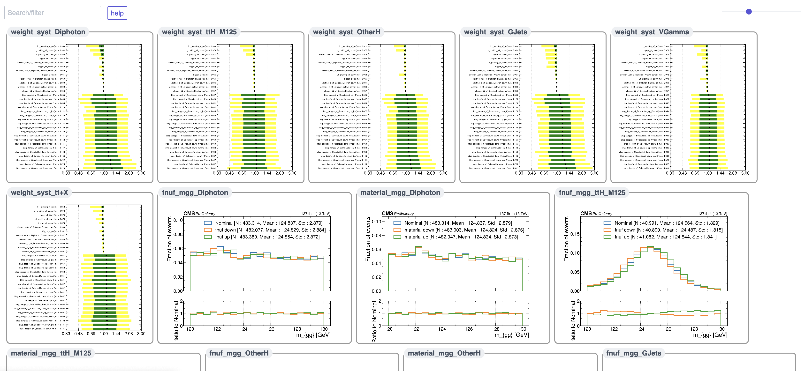

# HiggsDNA Tutorial
Welcome to the tutorial for the HiggsDNA (Higgs to Diphoton NanoAOD) framework! The [HiggsDNA](https://gitlab.cern.ch/HiggsDNA-project/HiggsDNA) repository provides tools for running a Higgs to diphoton analysis.

# 1. Introduction
HiggsDNA provides tools for developing and executing Higgs to diphoton analyses, starting from the nanoAOD data tier.
It was designed as a pure-python framework in order to achieve better integration with modern ML libraries like `xgboost` and `tensorflow` and to take advantage of highly performant columnar tools like `awkward` for performing selections and propagating systematics.

This tutorial provides an introduction to the framework, with setup details in Section 2 and details on using the code for physics analysis, through the example of a ttH analysis, in Section 3.

## 1.1 Columnar Analysis
HiggsDNA is based on a "columnar" style of analysis, where event selections are performed in a vectorized fashion (i.e. `numpy`-style operations).
One of the core dependencies of HiggsDNA is `awkward`, which is very similar to `numpy` in terms of user interface, but has the advantage of providing superior performance on "jagged" arrays.
A jagged array has one or more dimensions which are variable in length. In a HEP-context, this shows up quite frequently: for example, the number of hadronic jets in a given event may be 2, 11, or even 0.
`numpy` is not optimized to handle jagged arrays, while `awkward` is.

### 1.1.1 Columnar vs. Per-Event Analysis
Before diving into tools further, lets compare "columnar" analysis with "per-event" analysis, which is more traditionally used in HEP.
In "per-event" analysis, one explicitly performs loops through the events and objects in each event.
For example, consider a dummy analysis where we select for events with 3 or more jets, making some basic requirements on each jet.
In the "per-event" style:
```python
selected_events = []
for evt in events:
    n_jets = 0
    for jet in evt.Jet:
        if jet.pt < 25:
            continue
        if abs(jet.eta) < 2.4:
            continue
        n_jets += 1
    if n_jets >= 3:
        selected_events.append(evt)
```
vs. in the "columnar" style with `awkward`:
```
import awkward
jet_cut = (events.Jet.pt > 25.) & (abs(events.Jet.eta) < 2.4) 
selected_jets = events.Jet[jet_cut]

cut = awkward.num(selected_jets) >= 3
selected_events = events[cut]
```

Why should we prefer the columnar-style to the per-event-style?
The reason is that loops like the one shown above are extremely slow in `python`, due to the fact that `python` is not a compiled language and performs type-checking at each point in the loop.
While the columnar code above is not explicitly compiled, its operations are, and this gives us a substantial performance boost.
We will also see that the per-event style can still be used without the performance loss by using the module `numba`, which can perform compilation of `python` functions.

### 1.1.2 Complex selections in columnar-style
For something like counting the number of jets, it is simple enough to see how to translate per-event-style code into columnar-style code.
However, what if we are doing something more complicated, like creating Z candidates out of opposite-sign same-flavor (OSSF) lepton pairs?
Supposing we have already created arrays of our selected electrons and selected muons, we could construct OSSF lepton pairs as follows.
First, we will import the scikit-hep `vector` package, which allows us to perform four-vector operations and works nicely with `awkward`.
```python
import awkward
import vector
vector.register_awkward()
```
the `register_awkward()` line registers `awkward.Array` behaviors globally with `vector` so that when can identify certain `awkward` arrays as four vectors and have the operations overloaded as we expect (along with other functions and properties, like `.mass` or `.deltaR()`).
Back to our example:
```python
electrons = awkward.Array(electrons, with_name = "Momentum4D") # now we can do things like electrons.deltaR(photons)
ele_pairs = awkward.combinations(
    electrons, # objects of make combinations out of
    2, # how many objects in each combination
    fields = ["LeadLepton", "SubleadLepton"] # can access these as e.g. ee_pairs.LeadLepton.pt
)
```
we have now created all possible pairs of 2 electrons in each event. We could do the same for muons and then concatenate these arrays together:
```python
muon_pairs = awkward.combinations(muons, 2, fields = ["LeadLepton", "SubleadLepton"])
dilep_pairs = awkward.concatenate(
    [ele_pairs, muon_pairs], # arrays to concatenate
    axis = 1 # this keeps the number of events constant, and increases the number of pairs per event. axis = 0 would increase the number of events
)
dilep_pairs["ZCand"] = dilep_pairs.LeadLepton + dilep_pairs.SubleadLepton # these add as 4-vectors since we registered them as "Momentum4D" objects
```
Now we can place some cuts on the z candidates. Lets enforce that they are opposite-sign (same-flavor has already been enforced through construction) and have an invariant mass in the [86, 96] GeV range:
```
os_cut = dilep_pairs.LeadLepton.charge * dilep_pairs.SubleadLepton.charge == -1
mass_cut = (dilep_pairs.ZCand.mass > 86.) & (dilep_pairs.ZCand.mass < 96.)
cut = os_cut & mass_cut
dilep_pairs = dilep_pairs[cut]
```
At this point, we might want to flatten the Z candidates and perform any further analysis on a per-z-candidate basis (rather than per-event basis):
```
dilep_pairs = awkward.flatten(dilep_pairs) # no longer a jagged array
```
or we might want to simply select events that have at least 1 z-candidate:
```
z_candidate_cut = awkward.num(dilep_pairs) >= 1
events = events[z_candidate_cut]
```

If you prefer per-event analysis to columnar analysis, this is also possible in HiggsDNA!
Lets compare an even more complex example and see how this would be done in columnar-style and then in per-event style.
Suppose we want to select jets that are at least deltaR of 0.2 away from all selected leptons in an event.
In columnar style,
```python
def delta_R(objects1, objects2, min_dr):
    """
    Select objects from objects1 which are at least min_dr away from all objects in objects2.
    """
    # Step 1: make sure each of these arrays have at least 1 object for each
    if awkward.count(objects1) == 0 or awkward.count(objects2) == 0: # make sure each of these arrays have at least 1 object for each
        return objects1.pt < 0.

    # Step 2: make sure each array is cast as a four vector
    if not isinstance(objects1, vector.Vector4D):
        objects1 = awkward.Array(objects1, with_name = "Momentum4D")
    if not isinstance(objects2, vector.Vector4D):
        objects2 = awkward.Array(objects2, with_name = "Momentum4D")

    # Step 3: manipulate shapes so they can be cast together
    obj1 = awkward.unflatten(objects1, counts = 1, axis = -1) # shape [n_events, n_obj1, 1]
    obj2 = awkward.unflatten(objects2, counts = 1, axis = 0) # shape [n_events, 1, n_obj2]

    dR = obj1.deltaR(obj2) # shape [n_events, n_obj1, n_obj2]

    # Step 4: select objects from objects1 which are at least deltaR of min_dr away from all objects in objects2
    selection = awkward.all(dR >= min_dr, axis = -1) # shape [n_events, n_obj1]
    return selection
```
and in per-event style, we can use the package `numba` to compile our python loops.
```python
def delta_R_numba(objects1, objects2, min_dr):
    """
    This performs the exact same thing as the function before, but this calls an additional function, `compute_delta_R` which is compiled with `numba`.
    """
    n_objects1 = awkward.num(objects1)
    n_objects2 = awkward.num(objects2)

    offsets, contents = compute_delta_R(
            objects1, n_objects1,
            objects2, n_objects2,
            min_dr
    )

    selection = awkward_utils.construct_jagged_array(offsets, contents)

    return selection

@numba.njit # decorate function with a numba decorator so it gets compiled before it is called
def compute_delta_R(objects1, n_objects1, objects2, n_objects2, min_dr):
    n_events = len(objects1)

    offsets = numpy.zeros(n_events + 1, numpy.int64) # need to tell numba what type these are 
    contents = []

    for i in range(n_events):
        offsets[i+1] = offsets[i] + n_objects1[i]
        for j in range(n_objects1[i]):
            contents.append(True)
            offset_idx = offsets[i] + j
            for k in range(n_objects2[i]):
                if not contents[offset_idx]:
                    continue
                obj1 = vector.obj( # vector works nicely with numba!
                        pt = objects1[i][j].pt,
                        eta = objects1[i][j].eta,
                        phi = objects1[i][j].phi,
                        mass = objects1[i][j].mass
                )
                obj2 = vector.obj(
                        pt = objects2[i][k].pt,
                        eta = objects2[i][k].eta,
                        phi = objects2[i][k].phi,
                        mass = objects2[i][k].mass
                )
                dR = obj1.deltaR(obj2)
                if dR < min_dr:
                    contents[offset_idx] = False

    return offsets, numpy.array(contents)
```

### 1.1.3 Notes on `awkward`, `uproot`, and `vector`
When loading events from a flat `root` file, `uproot` and `awkward` work together nicely to load the events in an inuitive way:
```python
import uproot
import awkward

f_nano = "root://redirector.t2.ucsd.edu//store/user/hmei/nanoaod_runII/HHggtautau/ttHJetToGG_M125_13TeV_amcatnloFXFX_madspin_pythia8_RunIIFall17MiniAODv2-PU2017_12Apr2018_94X_mc2017_realistic_v14-v1_MINIAODSIM_v0.6_20201021/test_nanoaod_1.root"

with uproot.open(f_nano) as f:
    tree = f["Events"] # can access TTrees by name
    events = tree.arrays(library = "ak", how = "zip")
```
Here, by specifying `library = "ak", how = "zip"`, we are now able to access branches as records, with any jagged-length branches zipped together.
It is easiest to illusrate this through some examples:
```
events["MET_pt"] # access met pt
events.MET_pt # also works to access met pt

events.Jet # jagged array with all jet sub-fields accessible as records
events.Jet.pt # access jet pt
events.Jet.eta # or jet eta
events[("Jet", "pt")] # can also access them through a tupled name
```

In our `events = tree.arrays(...` line we could also specify to only read certain branches from the TTree, which can drastically improve the I/O time:
```
with uproot.open(f_nano) as f:
    tree = f["Events"] # can access TTrees by name
    events = tree.arrays(["MET_pt", "Jet_pt", "Jet_eta"], library = "ak", how = "zip")
```

When adding or modifying fields of an `awkward.Array`, it is important to call them by the string for their name.
For example, if we wanted to place a jet cut and update the jet collection:
```
jet_cut = events.Jet.pt > 25.
events["Jet"] = events.Jet[jet_cut] # works
events["Jet"] = events["Jet"][jet_cut] # also works
events.Jet = events.Jet[jet_cut] # does NOT work

# also true for creating new fields
events["SelectedJet"] = events.Jet[jet_cut] # works
events.SelectedJet = events.Jet[jet_cut] # does NOT work

# and for nested fields
events[("Jet", "pt")] = awkward.ones_like(events.Jet.pt) # works
events.Jet.pt = awkward.ones_like(events.Jet.pt) # does NOT work
events["Jet"].pt = awkward.ones_like(events.Jet.pt) # does NOT work
```
all of the examples above will run without error, but some of them do not do what you intend.

## 1.2 HiggsDNA : Concepts
The core idea behind HiggsDNA is to have an analysis be completely reproducible through two inputs:
1. A `json` file specifying the samples, selection, and systematics.
2. A commit hash of HiggsDNA (to ensure the actual code is the same)

Section 3 will explain how to set up your analysis ("analysis" may be an actual full analysis, or your preselection for making ntuples to develop your analysis and/or perform systematics studies, etc.) in the `json` style.
Here we explore the core code structure of HiggsDNA.

### 1.2.1 Tagger & TagSequence
For selections, the `Tagger` object is the starting point.
A new tagger can be created from the base `Tagger` class and has one function `calculate_selection` which needs to be defined.
This function should always take two arguments:
    1. `self` : i.e. the `Tagger` instance
    2. `events` : an `awkward.Array`
And it should always return two things:
    1. `cut` : the cut to select events for this `Tagger`
    2. `events` : the same `events` which were given as input, however, it may now have added fields

It is easiest to illustrate this through an example -- a tagger selecting events with at least one lepton would look like this:
```
from higgs_dna.taggers.tagger import Tagger
class LeptonicTagger(Tagger):
    def calculate_selection(self, events):
        electron_cut = (events.Electron.pt > 20.) & (abs(events.Electron.eta) < 2.5)
        events["SelectedElectron"] = events.Electron[electron_cut]

        muon_cut = (events.Muon.pt > 20.) & (abs(events.Muon.eta) < 2.5)
        events["SelectedMuon"] = events.Muon[muon_cut]

        n_leptons = awkward.num(events.SelectedElectron) + awkward.num(events.SelectedMuon)
        cut = n_leptons >= 1

        return cut, events
``` 

We can also import existing taggers:
```
from higgs_dna.taggers.diphoton_tagger import DiphotonTagger
dipho_tagger = DiphotonTagger(
        name = "my_diphoton_tagger",
)
```
Usually taggers are implemented with default options, which we can check with:
```
>>> dipho_tagger.options
{'photons': {'use_central_nano': True, 'pt': 25.0, 'eta': [[0.0, 1.4442], [1.566, 2.5]], 'e_veto': 0.5, 'hoe': 0.08, 'r9': 0.8, 'charged_iso': 20.0, 'charged_rel_iso': 0.3, 'hlt': {'eta_rho_corr': 1.5, 'low_eta_rho_corr': 0.16544, 'high_eta_rho_corr': 0.13212, 'eb_high_r9': {'r9': 0.85}, 'eb_low_r9': {'r9': 0.5, 'pho_iso': 4.0, 'track_sum_pt': 6.0, 'sigma_ieie': 0.015}, 'ee_high_r9': {'r9': 0.9}, 'ee_low_r9': {'r9': 0.8, 'pho_iso': 4.0, 'track_sum_pt': 6.0, 'sigma_ieie': 0.035}}}, 'diphotons': {'lead_pt': 35.0, 'sublead_pt': 25.0, 'lead_pt_mgg': 0.33, 'sublead_pt_mgg': 0.25, 'mass': [100.0, 180.0], 'select_highest_pt_sum': True}, 'trigger': {'2016': ['HLT_Diphoton30_18_R9Id_OR_IsoCaloId_AND_HE_R9Id_Mass90'], '2017': ['HLT_Diphoton30_22_R9Id_OR_IsoCaloId_AND_HE_R9Id_Mass90'], '2018': ['HLT_Diphoton30_22_R9Id_OR_IsoCaloId_AND_HE_R9Id_Mass90']}, 'gen_info': {'calculate': False, 'max_dr': 0.2, 'max_pt_diff': 15.0}}
```

And taggers can be chained together in a `TagSequence`:
```python
from higgs_dna.taggers.tag_sequence import TagSequence
tag_sequence = TagSequence(
    tag_list = [
        diphoton_tagger,
        leptonic_tagger
    ]
)
```
In constructing a tag sequence, the first tagger in the list will be run first and any events passing that taggers selection will be passed on to any ensuing taggers.
In this way, `leptonic_tagger` will only perform its calculations on events which passed the `diphoton_tagger` selection.

A tag sequence can also enforce orthogonality between multiple taggers. Orthogonality is indicated with a list within the list:
```python
tag_sequence = TagSequence(
    tag_list = [
        diphoton_tagger,
        [leptonic_tagger, some_other_tagger],
    ]
)
```
In this example, events which pass the `diphoton_tagger` will be given to both the `leptonic_tagger` and `some_other_tagger`, but the `TagSequence` will give priority to events entering the `leptonic_tagger` since it was given first in the list within the list.
In other words, any events that pass both `leptonic_tagger` selection and `some_other_tagger` selection will be marked as tagged by `leptonic_tagger`.

In a more realistic example, the STXS analysis might have a tag sequence that looks something like this:
```python
tag_sequence = TagSequence(
    tag_list = [
        diphoton_tagger,
        [thq_leptonic_tagger, tth_leptonic_tagger, vh_leptonic_tagger, ...
    ]
)
```

For optimizing performance, a useful design principle is to split taggers up into pieces. For example, my analysis might consist of:
1. Diphoton preselection
2. Analysis-specific preselection (e.g. cuts on leptons, jets, etc.)
3. BDT/DNN-based signal categorization

The BDT/DNN could be very large and computationally expensive to run, so we could split 2 and 3 into two separate taggers to only evaluate the BDT/DNN on events which pass the analysis preselection:
```python
tag_sequence = TagSequence(
    tag_list = [
        diphoton_tagger,
        analysis_presel_tagger,
        analysis_mva_sr_tagger
    ]
)
```

Finally, the `tag_list` argument can also be given as a `dict`/`json`-like input:
```python
tag_sequence = TagSequence(
    tag_list = [
        {
            "module_name" : "higgs_dna.taggers.diphoton_tagger",
            "tagger" : "DiphotonTagger",
        },
        {
            "module_name" : "higgs_dna.taggers.tutorial",
            "tagger" : "TTHPreselTagger"
        }
    ]
```
where the `TagSequence` instance will internally import the relevant modules and classes for us. This design principle becomes useful in completely `json`-ifying analyses.

### 1.2.2 Systematics
Systematics share a common base-class, `Systematic`, and are divided into three derived classes, shown in the diagram below:
1. EventWeightSystematic
2. ObjectWeightSystematic
3. SystematicWithIndependentCollection
 


To understand why this class structure is chosen, we must first understand how systematics are typically accounted for in HEP analyses.
First, systematics can either be implemented as variations in the event **weight** or an event **quantity**.

An example of the first would be the uncertainty in a lepton scale factor.
A lepton scale factor is required because our simulation of lepton reconstruction in the CMS detector does not exactly match reality (i.e. data).
These scale factors would typically be derived as a function of the lepton pT and eta, where we might find that for a lepton with pT of 25 GeV and eta of 2.1, the scale factor is 0.98, meaning leptons like this one are reconstructed with only 98% efficiency with respect to the predictions from simulation.
This scale factor would probably be derived with the tag-and-probe method in Z->ll events, but there are limitations to this: we dont know that the scale factor is *exactly* 0.98, and so we typically also derive an uncertainty.
Suppose the uncertainty is 0.01: this is a statement that leptons like this one are reconstructed with 98% +/- 1% with respect to the predictions from simulation.
For cases like this, we can simply vary the weights up and down to see how our signal or background model varies with the lepton scale factor uncertainty. 
We call systematics like these "weight systematics"

An example of the second would be the uncertainty in a jet energy correction.
Hadronic jets have energy corrections applied to them, i.e. `jet_pt_corrected = jet_pt_raw * jet_energy_correction`.
Typically these are derived by requiring pT balance in dijet and Z->ll + jets events (see JME group TWiki for many more details).
As for the lepton scale factor, this correction has some uncertainty, which we can vary up and down to see its effect on our signal and background models.
However, this cannot be treated in exactly the same way as the lepton scale factor for the following reason:
- when we vary the jet pT up or down, its pT changes
- if our selection makes requirements on the number of jets with pT above some value, varying the jet energy correction may result in an event which previously passed our selection to no longer pass the selection (or vice versa)

In this way, we end up with an entirely separate set of events passing our selection when we vary this systematic.
We call systematics like these "systematics with independent collections".

Realistic examples of both types of weight systematic (`EventWeightSystematic` and `ObjectWeightSystematic`) and systematics with independent collections (`SystematicWithIndependentCollection`)are given in Section 3.

In HiggsDNA, systematics can be explicitly created:
```python
from higgs_dna.systematics.systematic import EventWeightSystematic
l1_prefiring = EventWeightSystematic(
        name = "l1_prefiring",
        method = "from_branch",
        branches = {
            "central" : "L1PreFiringWeight_Nom",
            "up" : "L1PreFiringWeight_Up",
            "down" : "L1PreFiringWeight_Dn"
        },
        modify_central_weight = True
)

events = l1_prefiring.produce(events) # produce relevant branches
events = l1_prefiring.apply(events) # modify the central event weight
```

but it is easier to pass these as a dictionary/`json` to a `SystematicsProducer`, which will create all of them for us and apply and produce them at the appropriate times.
```python
from higgs_dna.systematics.systematics_producer import SystematicsProducer
systematic_options = {
    "weights" : {
        "L1_prefiring_sf" : {
                "type" : "event",
                "method" : "from_branch",
                "branches" : {
                    "central" : "L1PreFiringWeight_Nom",
                    "up" : "L1PreFiringWeight_Up",
                    "down" : "L1PreFiringWeight_Dn"
                },
                "modify_central_weight" : True,
                "years" : ["2016", "2017"]
            }
    "independent_collections" : {
            "fnuf" : {
                "method" : "from_function",
                "branch_modified" : ["Photon", "pt"],
                "function" : {
                    "module_name" : "higgs_dna.systematics.photon_systematics",
                    "name" : "fnuf_unc"
                }
            }
    }
}

systematics_producer = SystematicsProducer(options = systematic_options)
```

Details for specifying systematics from dictionary/`json`-like inputs are explained in Section 3.3.

### 1.2.3 Samples
A `Sample` is an object to hold relevant metadata for a given sample.
A `SampleManager` is, similar to a `SystematicsProducer`, an object which contains multiple `Sample` instances and facilitates common sample operations.

These can be accessed with
```python
from higgs_dna.samples.sample import Sample
from higgs_dna.samples.sample_manager import SampleManager
```
but typically you will not need to ever create these yourself. Instead you can specify the relevant details through your `json` file and HiggsDNA will take care of all the details -- see Section 3.4 for more details.

### 1.2.4 Job Management
Todo

### 1.2.5 Putting it all together: AnalysisManager
All aspects of HiggsDNA come together with the `AnalysisManager`, located in `higgs_dna.analysis.AnalysisManager`.
The relationship is depicted below:

 

In practice, it is not necessary to understand all of the details -- most users should be able to simply pass their config `json` files to `scripts/run_analysis.py` and have all of the details taken care of internally.
See Section 3 for more details on how this is done.

* * *

# 2. Setup
The installation procedure consists in the following steps:

**1. Clone this repository**
```  
git clone --recursive https://gitlab.cern.ch/HiggsDNA-project/HiggsDNA
cd HiggsDNA
```
**2. Install dependencies**

The necessary dependencies (listed in ```environment.yml```) can be installed manually, but the suggested way is to create a [conda environment](https://docs.conda.io/projects/conda/en/latest/user-guide/tasks/mana
ge-environments.html) by running:
``` 
conda env create -f environment.yml
```
the conda env can become pretty large (multiple GB), so you may want to specify an installation location in the above step with
```
conda env create -f environment.yml -p <path to install conda env>
```
then activate the environment with
```
conda activate higgs-dna
```
If you specified an installation path, your activation command will instead be:
```
conda activate <path to install conda env>/higgs-dna
```

** lxplus-specific notes **
If you are running on `lxplus` you may run into permission errors, which can be fixed with:
```
chmod 755 -R /afs/cern.ch/user/<your_username_first_initial>/<your_username>/.conda
```
You may also want to increase your disk quota at [this link](https://resources.web.cern.ch/resources/Manage/EOS/Default.aspx), otherwise you may run out of space while installing your `conda` environment.

Please note that the field ```python>=3.6``` will create an environment with the most recent stable version of Python. Change it to suite your needs (but still matching the requirement of Python>=3.6).

One additional package, `correctionlib`, must be installed via `pip`, rather than `conda`. Run
```
setup.sh
```
to install this script.

Note: if you see errors about the `gzip -d jsonpog-integration/POG/*/*/*.gz` due to files not found, you can manually add the `jsonpog-integration` submodule with:
```
git submodule add ssh://git@gitlab.cern.ch:7999/cms-nanoaod/jsonpog-integration.git
```

and make sure to match the commit hash currently linked in the `master` branch with
```
git checkout <commit_hash>
```

This should be taken care of already by including the `--recursive` flag during the `git clone` step, but you may run into this issue if you are updating an already cloned area of HiggsDNA.

Note: if you see warnings like:
```
gzip: jsonpog-integration/POG/TAU/2016postVFP_UL/tau.json already exists; do you wish to overwrite (y or n)?
```
it is safe to overwrite, this likely just means that you had previously un-zipped the files.

**3. Install ```higgs_dna```**

Install with:
``` 
pip install -e .
```

If you notice issues with the ```conda pack``` command for creating the tarball, try updating and cleaning your environment with (after running ```conda activate higgs-dna```):
```
conda env update --file environment.yml --prune
``` 

* * *

# 3. Using HiggsDNA for physics analysis : a ttH analysis 
## 3.1 Overview
The likely starting point for the majority of users is the `scripts/run_analysis.py` script. This script can be used to run a selection (i.e. a sequence of `higgs_dna.taggers.tagger.Tagger` objects) and apply scale factors and corrections (i.e. a set of `higgs_dna.systematics.systematic.Systematic` objects) over a list of samples (specified through a `json` file), and create a set of ntuple-like outputs (in the `parquet` format) with a specified set of fields (or ``branches''), merging the outputs and calculating scale1fb and scaling the normalization of weights for MC samples, if requested.

The `scripts/run_analysis.py` script can be used for a variety of purposes, including:
- **Developing an analysis** : creating ntuple-like files to form the starting point for developing an analysis (making data/MC plots, yield tables, training MVAs, etc).
- **Systematics studies** : creating ntuple-like files to form the starting point for performing systematics studies (e.g. deriving a correction/scale factor for photons in a Z->ee selection)
- **Running a full analysis** : running a selection, possibly with multiple tags, and propagating relevant systematicsand their associated uncertainties.

### 3.1.1 Quickstart cheatsheet/Q&A
- Where do I start? Probably `scripts/run_analysis.py` (see above).
- How do I implement the selection for my analysis? 
    1. Create a `Tagger` with your selection. See Sec. 3.2.1.
    2. Add the `Tagger` to your config file. See `metadata/tutorial/tth_preselection.json` for a simple ttH preselection `Tagger` added on top of the standard `DiphotonTagger`.
- How do I save additional variables to my output files? 
    1. Add variables to `events` array inside tagger with `higgs_dna.utils.awkward_utils.add_field` or `higgs_dna.utils.awkward_utils.add_object_fields`. See "Adding additional fields to outputs" under Sec. 3.2.1 and `higgs_dna/utils/awkward_utils.py` for more details.
    2. Add variable names to the `"variables_of_interest"` field in your config file.
- Where are my output files located? How are they organized?
    - They will be located under the directory you specify for `--output_dir` when running `scripts/run_analysis.py`.
    - A subdirectory will be created for each sample x year you run over.
    - Within each sample x year subdirectory, there will be subdirectories for each job.
    - Within each sample x year x job subdirectory, there will be a `.parquet` file for the nominal events called `output_job_N_nominal.parquet` and an additional one for each systematic with independent collection in the format `output_job_N_<SystName>_<SystVariation>.parquet`.
    - If you specify the `--merge_outputs` option when running `scripts/run_analysis.py`, you will additionally have merged `.parquet` files within each sample x year subdirectory and merged `.parquet` files with the events from all samples x years located in the directory you specify for `--output_dir`. These will also have added fields `process_id` and `year` to identify which sample and year a given event belongs to. A file `summary.json` will also be present and contains a map of `process_id` (int) to sample names.
    - If you specify the `--merge_outputs` option, event weights will also be multiplied by `scale1fb` and `lumi` for MC samples. The unmerged files will still have the original weights (not multiplied by `xs * bf * lumi / sum_of_weights`) if you did not desire for this to happen.
- How do I analyze my output files? There are some tools available to you under `higgs_dna/bonus/` to make data/MC plots and tables, assess systematics, etc. See Sec. 3.5 for more details.
- How do I add scale factors, corrections, or other systematics? See Sec. 3.3.
- How do I specify which samples/years I run over?
    - Most commonly used samples are planned to be available centrally within HiggsDNA. If the samples you want to run over are already in an existing catalog, you simply add the relevant samples and years to the `"samples"` field in your config file.
    - If you need to add a new sample, you can create a new catalog or add to an existing one. See Sec. 3.4 for more details.
- What happens if I ctrl-c or lose my screen while running `run_analysis.py`?
    - The script is designed to pick up right where it left off if this happens. It will remember the condor ids of any batch jobs, previous progress, etc. It is safe to ctrl-c and rerun the same command!
- Some jobs are taking forever to run, can I just ignore them and have HiggsDNA merge my outputs?
    - Yes, you can run `scripts/run_analysis.py` with the `--retire_jobs` option which will deem each sample x year as "complete" provided that at least 1 job has finished. If 0 jobs have finished for a given sample x year, it will wait until there is at least 1 finished and then deem the sample x year as "complete".
    - You can undo this and resubmit the retired jobs with the `--unretire_jobs` option. HiggsDNA will remerge your output files and properly adjust scale1fbs for MC samples. 
- It takes forever to find the files for my samples, can this be sped up?
    - Yes. When specifying samples through `xrootd` directories or DBS 3-slash format (accesssed through `dasgoclient`), it can take a while to query all of the files. The `SampleManager` will create a copy of your original samples `json` with the full list of files printed out. This will have the same name as your original catalog with `"_sample_manager_full"` appended to the end. In ensuing runs, you can switch your config `json` to point to this version of the catalog by changing the `["samples"]["catalog"]` field.


### 3.1.2 Creating a config file
The script can be configured to perform any of these tasks through a single `json` config file, where there are 5 main fields the user will want to pay attention to:
1. `"tag_sequence"` : a list which specifies a set of `higgs_dna.taggers.tagger.Tagger` objects and dictates the event selection.
2. `"systematics"` : a dictionary with two keys, `"weights"` and `"independent_collections"`, under which a dictionary is specified for each `higgs_dna.systematics.systematic.WeightSystematic` and `higgs_dna.systematics.systematic.SystematicWithIndependentCollection`, respectively.
3. `"samples"` : a dictionary which points to a catalog of samples, and specifies which samples and years should be processed from this catalog.
4. `"variables_of_interest"` : a list of variables which should be saved in the output `parquet` files
5. `"branches"` : a list of branches which should be read from the input nanoAODs.

There are two additional fields, which likely do not need to be changed by the user, but should be present:
6. `"name"` : a string which can identify this analysis
7. `"function"` : specifies which function should be run for each job. At the time of writing, this is always the `higgs_dna.analysis.run_analysis` function, but is left to be configurable for potential future needs.

A basic config file to run the diphoton preselection without systematics would look like this:
```json
{
    "name" : "diphoton_preselection",
    "function" : {
        "module_name" : "higgs_dna.analysis",
        "function_name" : "run_analysis"
    },
    "tag_sequence" : [
            {
                "module_name" : "higgs_dna.taggers.diphoton_tagger",
                "tagger" : "DiphotonTagger",
		"kwargs" : {
	            "name" : "diphoton_tagger",
		    "options" : {
			"gen_info" : { "calculate" : true }
		    }
		}
            }
    ],
    "systematics" : {
        "weights" : {},
        "independent_collections" : {}
    },
    "samples" : {
        "catalog" : "metadata/samples/tth_tutorial.json",
	"sample_list" : ["Data", "ttH_M125", "ggH_M125"],
	"years" : ["2016", "2017", "2018"]
    },
    "variables_of_interest" : [
        ["Diphoton", "mass"], ["Diphoton", "pt"], ["Diphoton", "eta"], ["Diphoton", "phi"], ["Diphoton", "dR"],
        ["LeadPhoton", "pt"], ["LeadPhoton", "eta"], ["LeadPhoton", "phi"], ["LeadPhoton", "mass"], ["LeadPhoton", "mvaID"], ["LeadPhoton", "genPartFlav"], ["LeadPhoton", "pixelSeed"],
        ["SubleadPhoton", "pt"], ["SubleadPhoton", "eta"], ["SubleadPhoton", "phi"], ["SubleadPhoton", "mass"], ["SubleadPhoton", "mvaID"], ["SubleadPhoton", "genPartFlav"], ["SubleadPhoton", "pixelSeed"],
        "GenHggHiggs_pt", "GenHggHiggs_eta", "GenHggHiggs_phi", "GenHggHiggs_mass", "GenHggHiggs_dR",
        "weight_central",
        "event"
    ],
    "branches" : [
            "Photon_pt", "Photon_eta", "Photon_phi", "Photon_mass",
            "Photon_pixelSeed", "Photon_mvaID", "Photon_electronVeto",
            "Photon_sieie",
            "Photon_r9", "Photon_hoe", "Photon_pfRelIso03_chg", "Photon_pfRelIso03_all",
            "Photon_isScEtaEB", "Photon_isScEtaEE",
            "Photon_trkSumPtHollowConeDR03", "Photon_photonIso", "Photon_chargedHadronIso",
            "Photon_genPartFlav",
 	    "GenPart_eta", "GenPart_genPartIdxMother", "GenPart_mass", "GenPart_pdgId", "GenPart_phi", "GenPart_pt", "GenPart_status","GenPart_statusFlags",
            "genWeight", "run", "event", "fixedGridRhoAll"
    ]
}
```

## 3.2 Constructing a tag sequence
We can illustrate most of the functionality through an example: suppose I want to develop a ttH analysis.
As a first step, we will run the standard diphoton preselection and a loose ttH preselection to produce a `parquet` file which we can use to make data/MC plots and yield tables and train MVAs.
We can construct a `json` file which will perform the diphoton preselection. We can start with the the file above, which is also located in `higgs_dna/metadata/tutorial/diphoton.json`.

In this example, the `DiphotonTagger` would be run over all events (with the default options listed in `higgs_dna/taggers/diphoton_tagger.py`), saving the variables listed under `"variables_of_interest"` into parquet files. All samples listed under `"samples"` will be processed for all years listed under `"years"`. To start, we can run over just the ttH sample and run over just a couple files:
```
python run_analysis.py
--log-level "DEBUG"
--config "metadata/tutorial/diphoton.json" 
--merge_outputs # merge all parquets into 1 file
--short # run just one job per sample/year
--sample_list "ttH_M125" # run over only these samples (csv)
--output_dir "tutorial_dipho" # directory to save outputs to
```

After verifying that there are no errors, we can remove the `--short` option and run over the full set of Run 2 ttH M125 MC.

Since the samples are accessed via `xrootd`, HiggsDNA will check for a valid proxy first and raise an error if it does not find one:
```
WARNING  [misc_utils : check_proxy] We were not able to find grid proxy or proxy was found to be      misc_utils.py:127
         expired. Output of 'voms-proxy-info': ['', "Couldn't find a valid proxy.", '']                                
ERROR    [CondorManager : prepare_inputs] We were not able to find grid proxy or proxy was found  sample_manager.py:114
         to be expired. Since you are accessing files through xrd, a valid proxy is necessary.                         
         NoneType: None 
```

After ensuring we have a valid proxy, HiggsDNA will first print out some summary info about the run options we selected with our config file. Next, it will run the `SampleManager` class to loop through each of the samples and years and grab the relevant files:
```
DEBUG    [SampleManager : get_samples] For sample 'ttH_M125', year '2018', found xs of 0.507100 pb sample_manager.py:73
         and bf of 0.002270                                                                                            
DEBUG    [SampleManager : get_samples] For sample 'ttH_M125', year '2018', we interpreted the     sample_manager.py:109
         specified files 'root://redirector.t2.ucsd.edu//store/user/hmei/nanoaod_runII/HHggtautau                      
         /ttHJetToGG_M125_13TeV_amcatnloFXFX_madspin_pythia8_RunIIAutumn18MiniAOD-102X_upgrade201                      
         8_realistic_v15-v1_MINIAODSIM_v0.6_20201021/' as a directory to be accessed via xrd                           
DEBUG    [SampleManager : get_files_from_xrd] We will find files for dir 'root://redirector.t2.uc sample_manager.py:270
         sd.edu//store/user/hmei/nanoaod_runII/HHggtautau/ttHJetToGG_M125_13TeV_amcatnloFXFX_mads                      
         pin_pythia8_RunIIAutumn18MiniAOD-102X_upgrade2018_realistic_v15-v1_MINIAODSIM_v0.6_20201                      
         021/' with the command:                                                                                       
          xrdfs root://redirector.t2.ucsd.edu/ ls /store/user/hmei/nanoaod_runII/HHggtautau/ttHJe                      
         tToGG_M125_13TeV_amcatnloFXFX_madspin_pythia8_RunIIAutumn18MiniAOD-102X_upgrade2018_real                      
         istic_v15-v1_MINIAODSIM_v0.6_20201021/                                                                        
DEBUG    [SampleManager : get_files_from_xrd] Found 17 files in dir 'root://redirector.t2.ucsd.ed sample_manager.py:277
         u//store/user/hmei/nanoaod_runII/HHggtautau/ttHJetToGG_M125_13TeV_amcatnloFXFX_madspin_p                      
         ythia8_RunIIAutumn18MiniAOD-102X_upgrade2018_realistic_v15-v1_MINIAODSIM_v0.6_20201021/' 
```

The `Manager` classes in `higgs_dna/job_management/managers` will then split the files into jobs which may either be submitted locally (default) or to `HTCondor`:
```
INFO     [Task: create_jobs] Task 'ttH_M125_2016' : splitting 10 input files into 4 jobs                     task.py:63
100%|███████████████████████████████████████████████████████████████████████████████████| 4/4 [00:00<00:00, 137.10it/s]
INFO     [Task: create_jobs] Task 'ttH_M125_2017' : splitting 10 input files into 4 jobs                     task.py:63
100%|███████████████████████████████████████████████████████████████████████████████████| 4/4 [00:00<00:00, 139.74it/s]
INFO     [Task: create_jobs] Task 'ttH_M125_2018' : splitting 17 input files into 6 jobs                     task.py:63
100%|███████████████████████████████████████████████████████████████████████████████████| 6/6 [00:00<00:00, 218.09it/s]
INFO     [AnalysisManager : run] Running 3 tasks with 37 total input files split over 3 total jobs.     analysis.py:283
```

NOTE: the current job management tools are planned to be superseded by `coffea` style tools.

The `Manager` will then periodically print out the progress of the jobs:
```
[JobsManager : summarize] Summarizing task progress.                                                          

INFO     [JobsManager : summarize] Task 'ttH_M125_2016' :                                                managers.py:81
                 1/1 (100.00 percent) jobs running                                                                     
INFO     [JobsManager : summarize] Task 'ttH_M125_2017' :                                                managers.py:81
                 1/1 (100.00 percent) jobs running                                                                                                                                                                                       
INFO     [JobsManager : summarize] Task 'ttH_M125_2018' :                                                managers.py:81
                 1/1 (100.00 percent) jobs completed
``` 
until all jobs are completed. Once all jobs are completed, it will then merge each of the individual `parquet` files. In the cases of merging files of different years or samples, new fields `year` and `process_id` will be added to the `parquet` files with relevant values. Merging will also calculate scale1fb values for MC samples (provided a cross section is given) based on the number of successfully processed events. This means that in the case of a single corrupt MC file that does not run successfully, your normalization will still be calculated correctly. The `weight_central` branch will be scaled according to the scale1fb and luminosity for the given year (though the unscaled values are still available in the unmerged files, if desired).

HiggsDNA lets us know that all jobs have completed and tells us where the merged `parquet` file is located:
```
INFO     [JobsManager : merge_outputs] For syst_tag 'nominal' merging 3 files into merged file          managers.py:126
         '/home/users/smay/HiggsDNA/scripts/tutorial_dipho/merged_nominal.parquet'.                                    
DEBUG             merging 539177 events                                                                 managers.py:130
INFO     [AnalysisManager : run] Finished running analysis 'diphoton_preselection'. Elapsed time:       analysis.py:302
         0:03:51.303396 (hours:minutes:seconds). 
```

It also prints out some useful information about the physics content and technical aspects of running:
```
[AnalysisManager : run] Task 'ttH_M125_2017', PERFORMANCE summary                                             
DEBUG             [PERFORMANCE : ttH_M125_2017] Processed 414189 total events in 0:01:12.598349         analysis.py:306
         (hours:minutes:seconds) of total runtime (5705.21 Hz).                                                        
DEBUG             [PERFORMANCE : ttH_M125_2017] Fraction of runtime spent on load: 91.28 percent        analysis.py:308
DEBUG             [PERFORMANCE : ttH_M125_2017] Fraction of runtime spent on syst: 0.00 percent         analysis.py:308
DEBUG             [PERFORMANCE : ttH_M125_2017] Fraction of runtime spent on taggers: 7.48 percent      analysis.py:308
DEBUG    [AnalysisManager : run] Task 'ttH_M125_2017', PHYSICS summary                                  analysis.py:310
DEBUG             [PHYSICS : ttH_M125_2017] events set 'nominal' has eff. of 49.59 percent (all         analysis.py:312
         taggers)                                                                                                      
DEBUG             [PHYSICS : ttH_M125_2017] With a cross section times BF of 0.001151117 pb and a sum   analysis.py:314
         of weights of 409277.240008000, scale1fb for this sample is 0.000002813
```

We can then explore this output file in several ways. One useful tool is located under `higgs_dna/bonus/assess.py` and will be described later in the tutorial, but for quick exploration, the `python` interpreter serves nicely:
```
python
Python 3.9.7 | packaged by conda-forge | (default, Sep 29 2021, 19:20:46) 
[GCC 9.4.0] on linux
Type "help", "copyright", "credits" or "license" for more information.
>>> import awkward
>>> events = awkward.from_parquet("tutorial_dipho/merged_nominal.parquet")
```

We can check the total number of raw events and the fields which are saved for each event:
```
>>> len(events)
539177
>>> events.fields
['Diphoton_mass', 'Diphoton_pt', 'Diphoton_eta', 'Diphoton_phi', 'Diphoton_dR', 'LeadPhoton_pt', 'LeadPhoton_eta', 'LeadPhoton_phi', 'LeadPhoton_mass', 'LeadPhoton_mvaID', 'LeadPhoton_genPartFlav', 'LeadPhoton_pixelSeed', 'SubleadPhoton_pt', 'SubleadPhoton_eta', 'SubleadPhoton_phi', 'SubleadPhoton_mass', 'SubleadPhoton_mvaID', 'SubleadPhoton_genPartFlav', 'SubleadPhoton_pixelSeed', 'GenHggHiggs_pt', 'GenHggHiggs_eta', 'GenHggHiggs_phi', 'GenHggHiggs_mass', 'GenHggHiggs_dR', 'event', 'weight_central_initial', 'weight_central', 'process_id', 'year']
```

We can check the total number of weighted events for all Run 2 and for an individual year:
```
>>> awkward.sum(events.weight_central)
77.62231871412764
>>> awkward.sum(events.weight_central[events.year == 2018])
33.89958685493177
```

We can check the diphoton pT and compare it to the gen-level pT:
```
>>> events.Diphoton_pt
<Array [91.8, 106, 110, 271, ... 13, 67.9, 230] type='539177 * float32'>
>>> events.GenHggHiggs_pt
<Array [91.2, 108, 109, 270, ... 13.4, 69, 224] type='539177 * float64'>
```

### 3.2.1 Adding a tagger to a tag sequence
Next, we can add a loose ttH preselection that one might use as a starting point for developing a ttH analysis: data/MC studies, training MVAs, etc.

For a loose ttH preselection we will define two orthogonal channels, hadronic and leptonic, targeting fully hadronic and semi/di-leptonic decays of the ttbar system, respectively.

The hadronic channel will require:
- exactly 0 leptons
- at least 4 jets
- at least 1 medium b-jet

while the leptonic channel will require:
- at least 1 lepton
- at least 2 jets

This is implemented in a `higgs_dna.taggers.tagger.Tagger` class under `higgs_dna/taggers/tutorial.py`. We will walk through this example.

The first (optional) step is creating a constructor for the tagger. This is not necessary, but in the example below we define the constructor such that the default options can be updated through the config `json`. In this way, to update a single cut value, for example the electron pT cut, this single value can be included in the config `json` and that value will be updated while leaving all other values as their default values:
```
def __init__(self, name, options = {}, is_data = None, year = None):
        super(TTHPreselTagger, self).__init__(name, options, is_data, year)

        if not options:
            self.options = DEFAULT_OPTIONS
        else:
            self.options = misc_utils.update_dict(
                    original = DEFAULT_OPTIONS,
                    new = options
            )
```

Next, we can define the function which actually performs the selection, `calculate_selection`. We will first select our physics objects: electrons, muons, and jets. The helper functions `select_electrons`, `select_muons`, and `select_jets` located under `higgs_dna/selections/lepton_selections.py` and `higgs_dna/selections/jet_selections.py` will be useful for this.

Each of these functions has default options which can be seen in their respective files. For example, for electrons, we see:
```python
DEFAULT_ELECTRONS = {
        "pt" : 10.0,
        "eta" : 2.4,
        "dxy" : 0.045,
        "dz" : 0.2,
        "id" : "WP90", # this means that the 90% eff working point ID will be used
        "dr_photons" : 0.2, # requires that all selected electrons be at least dR > 0.2 from selected photons
        "veto_transition" : True
}
```
Perhaps we would like to deviate from the default options, requiring higher pT for our electrons and muons. We can do this by setting some default options for our tagger (this could also be done inside the config `json`):
```python
DEFAULT_OPTIONS = {
    "electrons" : {
        "pt" : 20.0,
        "dr_photons" : 0.2
    },
    "muons" : {
        "pt" : 20.0,
        "dr_photons" : 0.2
    }
}   
```
In doing this, the pT cuts for the electrons and muons will be 20.0, while all other cuts will remain the same as the default options listed under `leptons_selections.py`. We also define the option `"dr_photons"` so that we can ensure the selected leptons are not overlapping with the selected photons.

We first calculate the cut which gives us the selected electrons from the input Electron collection:
```python
electron_cut = lepton_selections.select_electrons(
	electrons = syst_events.Electron,
	options = self.options["electrons"],
	clean = {
	    "photons" : {
		"objects" : syst_events.Diphoton.Photon,
		"min_dr" : self.options["electrons"]["dr_photons"]
	    }
	},
	name = "SelectedElectron",
	tagger = self
)
```
and then add these electrons to the events array with the name "SelectedElectron":
```python
electrons = awkward_utils.add_field(
	events = syst_events,
	name = "SelectedElectron",
	data = syst_events.Electron[electron_cut]
)
```
it is important to add the selected electrons to the events array if other Taggers or Systematics will need to access these (for example, if we wanted to calculate apply an electron scale factor, this would likely be applied on SelectedElectron, rather than the nominal Electron collection in the nanoAODs). We can then do the same for the muons and the jets.

We might also want to sort the jets by b-tag score (rather than pT by default) in order to do things like count the number of jets passing a given working point, or getting the highest b-tag score in an event. We can obtain a resorted version of the jets with:
```python
bjets = jets[awkward.argsort(jets.btagDeepFlavB, axis = 1, ascending = False)]
```
and define b-jets as those with a b-tag score greater than some working point (which likely varies by year):
```python
bjets = bjets[bjets.btagDeepFlavB > self.options["btag_wp"][self.year]]
```

we can then finish our preselection by making requirements on the number of leptons and jets:
```python
# Preselection
n_electrons = awkward.num(electrons)
n_muons = awkward.num(muons)
n_leptons = n_electrons + n_muons

n_jets = awkward.num(jets)
n_bjets = awkward.num(bjets)

# Hadronic presel
hadronic = (n_leptons == 0) & (n_jets >= 4) & (n_bjets >= 1)

# Leptonic presel
leptonic = (n_leptons >= 1) & (n_jets >= 2)

presel_cut = hadronic | leptonic

return presel_cut, syst_events
```

### Advanced selections
Suppose we also want to apply a z-veto for events with two opposite-sign opposite-charge leptons.
We can first register these as four-vectors so that `awkward` knows to add them as four-vectors when we add them together:
```
# Register as `vector.Momentum4D` objects so we can do four-vector operations with them
electrons = awkward.Array(electrons, with_name = "Momentum4D")
muons = awkward.Array(muons, with_name = "Momentum4D")
```

We can then construct all ee and mumu pairs:
```
# Construct di-electron/di-muon pairs
ee_pairs = awkward.combinations(
        electrons, # objects to make combinations out of
        2, # how many objects go in a combination
        fields = ["LeadLepton", "SubleadLepton"] # can access these as e.g. ee_pairs.LeadLepton.pt
)
mm_pairs = awkward.combinations(muons, 2, fields = ["LeadLepton", "SubleadLepton"])

# Concatenate these together
z_cands = awkward.concatenate([ee_pairs, mm_pairs], axis = 1)
z_cands["ZCand"] = z_cands.LeadLepton + z_cands.SubleadLepton # these add as 4-vectors since we registered them as "Momentum4D" objects
```
and now consider only Z candidates which are opposite-sign and have a dilepton mass in the Z mass window:
```
# Make Z candidate-level cuts
os_cut = z_cands.LeadLepton.charge * z_cands.SubleadLepton.charge == -1
mass_cut = (z_cands.ZCand.mass > 86.) & (z_cands.ZCand.mass < 96.)
z_cut = os_cut & mass_cut
z_cands = z_cands[z_cut] # OSSF lepton pairs with m_ll [86., 96.]
```
and finally translate this into an event-level cut -- we will veto any events with at least 2 electrons or at least 2 muons that has at least 1 passing Z candidate:
```
# Make event level cut
has_z_cand = awkward.num(z_cands) >= 1 # veto any event that has a Z candidate
ee_event = awkward.num(electrons) >= 2
mm_event = awkward.num(muons) >= 2
z_veto = ~(has_z_cand & (ee_event | mm_event))
```

Lastly, we can register individual cuts with the `Tagger` object to have it print out diagnostic info for us:
```
presel_cut = (hadronic | leptonic) & z_veto & photon_id_cut
self.register_cuts(
    names = ["hadronic presel", "leptonic presel", "z veto", "photon ID cut", "all"],
    results = [hadronic, leptonic, z_veto, photon_id_cut, presel_cut]
)
```
This step is not necessary, but will print out some useful info that can be helpful for debugging and sanity checks:
```
DEBUG    [Tagger] : my_TTHPreselTagger, syst variation : nominal, cut type : event, cut : hadronic       tagger.py:154
         presel, efficiency : 0.5389                                                                                  
DEBUG    [Tagger] : my_TTHPreselTagger, syst variation : nominal, cut type : event, cut : leptonic       tagger.py:154
         presel, efficiency : 0.3011                                                                                  
DEBUG    [Tagger] : my_TTHPreselTagger, syst variation : nominal, cut type : event, cut : z veto,        tagger.py:154
         efficiency : 0.9990                                                                                          
DEBUG    [Tagger] : my_TTHPreselTagger, syst variation : nominal, cut type : event, cut : photon ID cut, tagger.py:154
         efficiency : 0.6953                                                                                          
DEBUG    [Tagger] : my_TTHPreselTagger, syst variation : nominal, cut type : event, cut : all,           tagger.py:154
         efficiency : 0.5917
```
The diphoton tagger and the ttH preselection tagger can be included together in a tag sequence as shown in the config file `metadata/tutorial/tth_preselection.json` and we can test this for a few ttH MC files with the command:
```
python run_analysis.py --log-level "DEBUG" --config "metadata/tutorial/tth_preselection.json" --merge_outputs --sample_list "ttH_M125" --output_dir "tutorial_tth" --short
```

### Adding additional fields to outputs
In our example, we saved a variety of variables related to the diphoton pair. For most analyses, you will want to save additional variables to make data/MC plots with, use in BDT/DNN training, etc.

To do this, we would first calculate these variables in the tagger, and then they can be added to the events array with helper functions from `higgs_dna.utils.awkward_utils`.

For a simple event-level quantity, like the number of leptons or jets, use the `add_field` function:
```
awkward_utils.add_field(
    syst_events, # array to add this field to 
    "n_leptons", # name to give the field
    n_leptons # actual data for the field
)
```
For an object-level quantity, or more generally, a quantity that may have a variable length for each event, use the `add_object_fields` function. If we wanted to add the leading four jet kinematics, we could use:
```
awkward_utils.add_object_fields(
    events = syst_events,
    name = "jet",
    objects = jets,
    n_objects = 4,
    dummy_value = -999
)
```
This will add all fields of `jets` to `syst_events` with names of the format "jet_1_pt", "jet_3_eta", etc.
For events with less than 4 jets, the fields will be "zero-padded" and a dummy value of `dummy_value` will be assigned. For example, if an event has only 2 jets, all "jet_3_*" and "jet_4_*" fields will be filled with `dummy_value` for that event.

To save added fields in your output `parquet` files, simply add these to the `"variables_of_interest"` field in your config file. 

### 3.3 Adding systematics
Next, we can start to add corrections and scale factors (and possibly their uncertainties) to our analysis.
Each systematic is implemented through a class derived from the `Systematic` class in `higgs_dna/systematics/systematic.py`.
There are two main types of systematics to consider:
1. `WeightSystematic`: a correction and/or uncertainty on a weight
    - `EventWeightSystematic`: a correction and/or uncertainty on the *central event weight*. This can be any of: event weight correction (e.g. pileup reweighting scale factor), event weight uncertainty (e.g. QCD scale/PDF/alpha_s weights. Up/down variations for the weight in each event, but does not modify the central event weight), or event weight correction and uncertainty (e.g. pileup reweighting scale factor and up/down variations)
    - `ObjectWeightSystematic`: a correction and/or uncertainty on a *per-object weight*. Almost always translated into a per-event weight. For example, lepton ID SFs: the scale factor ("correction") is calculated on a per-lepton basis. This gets translated into a per-event weight by multiplying the scale factors of each lepton selected by a tagger in each event.
2. `SystematicWithIndependentCollection`: varies a per-event (e.g. MET resolution up/down) or per-object (e.g. photon scales/smearings up/down) quantity, and results in an entirely new set of events.
    - Q: what do you mean, "an entirely new set of events?"?
    - A: consider an example: the pT of hadronic jets are scaled by a correction factor called the Jet Energy Correction (JEC), usually derived and provided centrally by the JME group for CMS-wide use. There is some uncertainty in the JEC for a particular jet. If we vary the JEC up/down, we get two new values of jet pT. If my selection then involves cuts on the pT of jets, it is possible that in the nominal case a given event passes my jet threshold, while in the up/down variation that same event now does not pass because the jets have different pTs. For this reason, it is necessary to compute selections over each such variation. In HiggsDNA, the strategy currently taken is to "clone" the events for each such systematic variation, which we call a "systematic with an independent collection", and recompute the entire selection over the "cloned" events. 

Systematics can be specified through the config `json` file under the `"systematics"` field. This field is expected to contain a dictionary with two fields, `"weights"` and `"independent_collections"`, where the former will be translated into `WeightSystematic` objects and the latter will be translated into `SystematicWithIndependentCollection` objects by the `SystematicsProducer` class under `higgs_dna/systematics/systematics_producer.py`.

### 3.3.1 EventWeightSystematic 
We will first examine how to implement various types of weight systematics. The simplest example is the case where the relevant weight(s) are stored as branches in the nanoAOD, like the L1-prefiring inefficieny and uncertainties. Supposing the central/up/down weights are stored as `L1PreFiringWeight_Nom`/`L1PreFiringWeight_Up`/`L1PreFiringWeight_Dn`, we can implement this in the following way:
```json
"systematics" : {
        "weights" : {
            "L1_prefiring_sf" : {
                "type" : "event",
                "method" : "from_branch",
                "branches" : {
                    "central" : "L1PreFiringWeight_Nom",
                    "up" : "L1PreFiringWeight_Up",
                    "down" : "L1PreFiringWeight_Dn"
                },
                "modify_central_weight" : true,
                "years" : ["2016", "2017"]
            }
        }
}
``` 
We can step through this entry line-by-line. First, it is given a name `"L1_prefiring_sf"` which will identify resulting fields in the output parquet files. Next,
```
"type" : "event"
```
indicates that this is an event-level weight, as opposed to an object-level weight (for which we would assign a key of `"object"`). The method is indicated as
```
"method" : "from_branch"
```
meaning that the central/up/down variations will be read from branches in the input nanoAOD. Many systematics are not already present in the nanoAOD and need to be calculated on-the-fly. For these, we would assign a key of `"from_function"` and point to the relevant function in HiggsDNA. Since we have indicated that this is read from branches, we next provide the relevant branches:
```
"branches" : {
    "central" : "L1PreFiringWeight_Nom",
    "up" : "L1PreFiringWeight_Up",
    "down" : "L1PreFiringWeight_Dn"
}
```
We next indicate that the central weight of this systematic should modify (multiplicatively) the central event weight:
```
"modify_central_weight" : true
```
If we had instead indicated `false`, the central event weight would not be modified, but the central/up/down variations of the weight would still be stored in our output `parquet` files.
Finally, we indicate that this systematic is only applicable for specific years:
```
"years" : ["2016", "2017"]
```
We could also indicate if a systematic is only applicable for specific samples (e.g. some theory uncertainties) or for specific taggers. TODO: provide these examples.

A `WeightSystematic` does not need to modify the central value or even have a central value: a theory uncertainty which only adds an uncertainty but does not modify the central weight might look something like this:
```json
"dummy_theory_sf" : {
    "type" : "event",
    "method" : "from_branch",
    "branches" : { "central" : "genWeight", "up" : "genWeight", "down" : "genWeight" },
    "modify_central_weight" : false
}
```

### 3.3.2 ObjectWeightSystematic
The syntax for implementing an `ObjectWeightSystematic` is similar, but we must also provide the *input* and *target* collections. The input collection is the set of objects on which this scale factor can be calculated while the target collection is the set of objects which should be used to derive the resulting event-level weight.

We can see this through the example of the electron ID SF:
```json
"electron_id_sf" : {
    "type" : "object",
    "method" : "from_function",
    "function" : {
        "module_name" : "higgs_dna.systematics.lepton_systematics",
        "name" : "electron_id_sf"
    },
    "modify_central_weight" : true,
    "input_collection" : "Electron",
    "target_collections" : ["SelectedElectron"],
    "kwargs" : {
        "working_point" : "wp90iso"
    }
}
```
Going through this entry line-by-line again, we see that `"method"` is indicated as `"from_function"`, meaning a function inside HiggsDNA will be used to calculate the weight variations. We specify this function:
```
"function" : {
        "module_name" : "higgs_dna.systematics.lepton_systematics",
        "name" : "electron_id_sf"
    }
```
which means that there is a function inside `higgs_dna/systematics/lepton_systematics.py` named `"electron_id_sf"` which will be used to calculate the weight variations.
The input collection is indicated as the nominal electron collection from nanoAOD:
```
"input_collection" : "Electron"
```
and the target collection is indicated as the `"SelectedElectron"` collection which we defined inside our `TTHPreselTagger` class:
```
"target_collections" : ["SelectedElectron"]
```
The target collection is given as a list, as there could be multiple target collections we apply this to. For example, another tagger may have a tighter pT requirement on their electrons and would want to calculate the event-level SF based on these higher pT electrons, which they might name `"SelectedHighPtElectron"`. In this case, we could pass both target collections:
```
"target_collections" : ["SelectedElectron", "SelectedHighPtElectron"],
```
and indicate which collection corresponds to which tagger through a `"modifies_taggers"` field: TODO add example.
We also indicated some keyword arguments for the function:
```
"kwargs" : {
    "working_point" : "wp90iso"
}
```
indicating that we want the scale factors corresponding to the 90 percent working point which includes isolation.
We can next examine the function used to calculate the weight variations, which relies on the CMS `correctionlib` package.

In general, all functions used to calculate weight systematics should include the following keyword arguments: `"events"`, `"year"`, `"central_only"`, and for `ObjectWeightSystematics`, `"input_collection"`. The `SystematicsProducer` will check if the function is configured properly and raise an error if not. There can be arbitarily many additional keyword arguments whose values can be set throug the `"kwargs"` field as above. They should return a dictionary of variations, whose keys may include any subset of `"central"`, `"up"`, and `"down"`.

The electron ID SF function, `higgs_dna.systematics.lepton_systematics.electron_id_sf` reads corrections from a json file provided by the EGM POG:
```python
ELECTRON_ID_SF_FILE = {
    "2016" : "jsonpog-integration/POG/EGM/2016postVFP_UL/electron.json",
    "2017" : "jsonpog-integration/POG/EGM/2017_UL/electron.json",
    "2018" : "jsonpog-integration/POG/EGM/2018_UL/electron.json"
}

ELECTRON_ID_SF = {
    "2016" : "2016postVFP",
    "2017" : "2017",
    "2018" : "2018"
}

def electron_id_sf(events, year, central_only, input_collection, working_point = "none"):
    """
    See:
        - https://cms-nanoaod-integration.web.cern.ch/commonJSONSFs/EGM_electron_Run2_UL/EGM_electron_2017_UL.html
        - https://gitlab.cern.ch/cms-nanoAOD/jsonpog-integration/-/blob/master/examples/electronExample.py
    """

    required_fields = [
        (input_collection, "eta"), (input_collection, "pt")
    ]

    missing_fields = awkward_utils.missing_fields(events, required_fields)

    evaluator = _core.CorrectionSet.from_file(misc_utils.expand_path(ELECTRON_ID_SF_FILE[year]))
    
    electrons = events[input_collection]

    # Flatten electrons then convert to numpy for compatibility with correctionlib
    n_electrons = awkward.num(electrons)
    electrons_flattened = awkward.flatten(electrons)

    ele_eta = numpy.clip(
        awkward.to_numpy(electrons_flattened.eta),
        -2.49999,
        2.49999 # SFs only valid up to eta 2.5
    )

    ele_pt = numpy.clip(
        awkward.to_numpy(electrons_flattened.pt),
        10.0, # SFs only valid for pT >= 10.0
        499.999 # and pT < 500.
    )

    # Calculate SF and syst
    variations = {}
    sf = evaluator["UL-Electron-ID-SF"].evalv(
            ELECTRON_ID_SF[year],
            "sf",
            working_point,
            ele_eta,
            ele_pt
    )
    variations["central"] = awkward.unflatten(sf, n_electrons)

    if not central_only:
        syst = evaluator["UL-Electron-ID-SF"].evalv(
                ELECTRON_ID_SF[year],
                "syst",
                working_point,
                ele_eta,
                ele_pt
        )
        variations["up"] = variations["central"] + awkward.unflatten(syst, n_electrons)
        variations["down"] = variations["central"] - awkward.unflatten(syst, n_electrons)


    for var in variations.keys():
        # Set SFs = 1 for leptons which are not applicable
        variations[var] = awkward.where(
                (electrons.pt < 10.0) | (electrons.pt >= 500.0) | (abs(electrons.eta) >= 2.5),
                awkward.ones_like(variations[var]),
                variations[var]
        )

    return variations
```

### 3.3.3 SystematicWithIndependentCollection
Finally, we will see how to add a systematic which varies an event- or object-level quantity and results in an entirely new set of events. Similar to `WeightSystematic`, a `SystematicWithIndependentCollection` can be specified to be read from a branch. 

For example, if we had uncertainties on the photon energy scale saved in nanoAOD branches as `"Photon_pt_up"` and `"Photon_pt_down"`, we could create independent collections for the up/down variations with:
```json
"dummy_photon_pt_syst" : {
    "method" : "from_branch",
    "branch_modified" : ["Photon", "pt"],
    "branches" : {
        "up" : ["Photon", "pt_up"],
        "down" : ["Photon", "pt_down"]
    }
 }
``` 
where the `"branch_modified"` field indicates that each of the variations, `"up"` and `"down"`, are provided varied values for the branch `"Photon_pt"`.

A `SystematicWithIndependentCollection` can also be specified through a function, in the same way as for a `WeightSystematic`. This is shown below.

Now, lets put this together with some realistic systematics. We will include the following scale factors and their uncertainties:
- electron veto SF
- diphoton trigger SF
- b-tag DeepJet reshaping SF
- electron ID SF
- L1 pre-firing inefficiency
and the following uncertainties on the photon pT scale which are systematics with independent collections:
- material uncertainty
- FNUF uncertainty

In our config file, this looks like the following:
```json
"systematics" : {
    "weights" : {
        "electron_veto_sf" : {
            "type" : "object",
            "method" : "from_function",
            "function" : {
                "module_name" : "higgs_dna.systematics.photon_systematics",
                "name" : "photon_electron_veto_sf"
             },
             "modify_central_weight" : true,
             "input_collection" : "Photon",
             "target_collections" : [["Diphoton", "Photon"]]
        },
        "trigger_sf" : {
            "type" : "event",
            "method" : "from_function",
            "function" : {
                "module_name" : "higgs_dna.systematics.photon_systematics",
                "name" : "trigger_sf"
            },
            "modify_central_weight" : true,
            "requires_branches" : ["Diphoton", "LeadPhoton", "SubleadPhoton"]
        },
        "btag_deepjet_sf" : {
            "type" : "object",
            "method" : "from_function",
            "function" : {
                "module_name" : "higgs_dna.systematics.jet_systematics",
                "name" : "btag_deepjet_reshape_sf"
            },
            "modify_central_weight" : true,
            "input_collection" : "Jet",
            "target_collections" : ["SelectedJet"]
        },
        "electron_id_sf" : {
            "type" : "object",
            "method" : "from_function",
            "function" : {
                "module_name" : "higgs_dna.systematics.lepton_systematics",
                "name" : "electron_id_sf"
            },
            "modify_central_weight" : true,
            "input_collection" : "Electron",
            "target_collections" : ["SelectedElectron"],
            "kwargs" : {
                "working_point" : "wp90iso"
            }
        },
        "L1_prefiring_sf" : {
            "type" : "event",
            "method" : "from_branch",
            "branches" : {
                "central" : "L1PreFiringWeight_Nom",
                "up" : "L1PreFiringWeight_Up",
                "down" : "L1PreFiringWeight_Dn"
            },
            "modify_central_weight" : true,
            "years" : ["2016", "2017"]
        }
    "independent_collections" : {
        "fnuf" : {
            "method" : "from_function",
            "branch_modified" : ["Photon", "pt"],
            "function" : {
                "module_name" : "higgs_dna.systematics.photon_systematics",
                "name" : "fnuf_unc"
            }
        },
        "material" : {
            "method" : "from_function",
            "branch_modified" : ["Photon", "pt"],
            "function" : {
                "module_name" : "higgs_dna.systematics.photon_systematics",
                "name" : "material_unc"
            }
        }
    }
}
```

### 3.4 Defining a list of samples
So far, we have run on just a few ttH files, but now we can run our preselection (diphoton selection + loose ttH selection) at scale. The `"samples"` entry of the config file allows us to specify which samples and years to run over:
```json
"samples" : {
    "catalog" : "metadata/samples/tth_tutorial.json",
    "sample_list" : ["Data", "ttH_M125", "ggH_M125"],
    "years" : ["2016", "2017", "2018"]
}
```
The `"catalog"` is a comprehensive dictionary (`json`) of many samples and their metadata and we can select which ones we run over by including the relevant keys in `"sample_list"` and the years for which we want to run in `"years"`.

In the future, there will ideally be exhaustive catalogs maintained in the HiggsDNA repository by developers that will be available for users to access, but lets examine how to create a catalog. The main things we want to pay attention to are the cross section, branching fraction, and files:
```json
"ttH_M125" : {
    "xs" : 0.5071,
    "bf" : 0.00227,
    "files" : {
        "2016" : "root://redirector.t2.ucsd.edu//store/user/hmei/nanoaod_runII/HHggtautau/ttHJetToGG_M125_13TeV_amcatnloFXFX_madspin_pythia8_RunIIFall17MiniAODv2-PU2017_12Apr2018_94X_mc2017_realistic_v14-v1_MINIAODSIM_v0.6_20201021/",
        "2017" : "root://redirector.t2.ucsd.edu//store/user/hmei/nanoaod_runII/HHggtautau/ttHJetToGG_M125_13TeV_amcatnloFXFX_madspin_pythia8_RunIIFall17MiniAODv2-PU2017_12Apr2018_94X_mc2017_realistic_v14-v1_MINIAODSIM_v0.6_20201021/",
        "2018" : "root://redirector.t2.ucsd.edu//store/user/hmei/nanoaod_runII/HHggtautau/ttHJetToGG_M125_13TeV_amcatnloFXFX_madspin_pythia8_RunIIAutumn18MiniAOD-102X_upgrade2018_realistic_v15-v1_MINIAODSIM_v0.6_20201021/"
    }
}
```
Cross sections are assumed to be in units of [pb] and branching fractions are assumed to be 1 if not specified. Files can be specified in multiple ways:
- hard-coded list of files, e.g. `"2016" : ["ntuple1.root", "ntuple2.root"]`
- a directory (or list of directories). These can be either a local directory or an xrootd directory (as above). In the former case, `glob` will be used to find all `.root` files in the directory(s), while in the latter `xrootd` utilities will be used to find relevant files.
- a DBS "three-slash" format dataset, e.g. `"EGamma/Run2018A.../NANOAOD"`. In this case, `dasgoclient` will be used to fetch the relevant files.

Systematics that are specific to a particular sample (maybe special theory weights and/or uncertainties) can also be included in the catalog and will be calculated for that sample only.

We can now run over the following samples:
- Signal and resonant backgrounds: ttH, gluon fusion Higgs production, WH and ZH, and vector boson fusion
- Non-resonant backgrounds: diphoton + jets, gamma + jets, V + gamma, tt + jets, tt + gamma + jets, tt + gamma gamma
- full Run 2 data from `DoubleEG` and `EGamma` datasets

In the config, this looks like:
```
"samples" : {
    "catalog" : "metadata/samples/tth_tutorial.json",
    "sample_list" : ["Data", "ttH_M125", "ggH_M125", "Diphoton", "VH_M125", "VBFH_M125", "ZGamma", "WGamma", "TTGG", "TTGamma", "TTJets", "GJets_HT-600ToInf", "GJets_HT-400To600", "GJets_HT-200To400", "GJets_HT-100To200", "GJets_HT-40To100"],
    "years" : ["2016", "2017", "2018"]
}
```

Given that we have many samples and files to run over, we should utilize HTCondor for more computing power. We can run our preselection (diphoton + loose ttH preselection) and propagate systematics over all the above samples with the following command: 
```
python run_analysis.py --log-level "DEBUG" --config "metadata/tutorial/tth_presel_withSyst.json" --merge_outputs --output_dir "tutorial_tth_withSyst" --batch_system "condor"
```
which took just under 5 hours for me (averaging a couple hundred condor slots at a time), YMMV.

Note: job submission on `lxplus` with an `/eos` output directory will not be able to run. The reason is that `lxplus` does not allow HTCondor log files to be placed in `/eos`, see [this page](https://batchdocs.web.cern.ch/troubleshooting/eos.html) . As a workaround, submit jobs with the output directory specified as your work area (or home area if you do not have a work area on `lxplus`). Once the jobs have finished, you can copy the results to your `/eos` area if desired. In the future, it would be nice to have the ability to submit directly with `/eos` as the output directory, but this is not yet implemented.

### 3.4.1 Job submission and debugging

You may notice that some jobs fail repeatedly:
```
WARNING  [Task : process] WARNING: Task 'TTGamma_2017' had to retire job 'TTGamma_2017_14' since it ran    task.py:131
         unsuccessfully for 5 straight times. If this is an MC sample, this will just reduce your                     
         statistics. If this is a data job, you have processed less events than you intended!
```
In this case, this is because some of the input nanoAOD files are corrupt. For MC, this simply reduces our statistics; however, for data we should ensure that all events are properly processed. Given that this is just a tutorial exercise, we can live with the 0.5% of missing data jobs.
By default, HiggsDNA will "retire" a job after 5 unsuccesful tries. This allows the script to finish merging all of the outputs so you at least have something to work with. If you wish to resubmit all of the failed jobs again, you can do so by rerunning `run_analysis.py` with the `--unretire_jobs` argument. This will also reperform the merging and scale1fb calculation, so all of your MC will still be correctly normalized.

HiggsDNA will also tell us exactly which jobs failed so we can navigate to their respective directories and investigate the log files, rerun locally by hand, etc:
```
WARNING  [AnalysisManager : run] WARNING: there were 33 retired jobs (meaning they failed up to the    analysis.py:322
         maximum number of retries). You may want to look into these:                                                 
WARNING           Data_2016_206                                                                        analysis.py:324
WARNING           Data_2016_268                                                                        analysis.py:324
WARNING           Data_2017_231                                                                        analysis.py:324
WARNING           Data_2017_258                                                                        analysis.py:324
WARNING           Data_2018_368                                                                        analysis.py:324
WARNING           Data_2018_619                                                                        analysis.py:324
WARNING           Data_2018_1033                                                                       analysis.py:324
WARNING           Data_2018_1104                                                                       analysis.py:324
WARNING           Data_2018_1207                                                                       analysis.py:324
WARNING           Diphoton_2017_32                                                                     analysis.py:324
WARNING           ZGamma_2016_25                                                                       analysis.py:324
WARNING           WGamma_2017_3                                                                        analysis.py:324
WARNING           TTGamma_2017_14                                                                      analysis.py:324
WARNING           TTJets_2016_50                                                                       analysis.py:324
WARNING           TTJets_2016_56                                                                       analysis.py:324
WARNING           TTJets_2016_84                                                                       analysis.py:324
WARNING           TTJets_2016_103                                                                      analysis.py:324
WARNING           TTJets_2017_182                                                                      analysis.py:324
WARNING           TTJets_2017_440                                                                      analysis.py:324
WARNING           TTJets_2017_476                                                                      analysis.py:324
WARNING           TTJets_2017_487                                                                      analysis.py:324
WARNING           TTJets_2017_489                                                                      analysis.py:324
WARNING           TTJets_2017_539                                                                      analysis.py:324
WARNING           TTJets_2017_557                                                                      analysis.py:324
WARNING           TTJets_2017_577                                                                      analysis.py:324
WARNING           TTJets_2017_600                                                                      analysis.py:324
WARNING           TTJets_2017_608                                                                      analysis.py:324
WARNING           TTJets_2017_639                                                                      analysis.py:324
WARNING           TTJets_2017_650                                                                      analysis.py:324
WARNING           TTJets_2017_660                                                                      analysis.py:324
WARNING           TTJets_2018_258                                                                      analysis.py:324
WARNING           TTJets_2018_606                                                                      analysis.py:324
WARNING           GJets_HT-100To200_2018_37                                                            analysis.py:324
```

For example, if we navigate to `tutorial_tth_withSyst/Data_2016/job_2016` we see the `json` config file for the job, the `python` wrapper, the executable that will be run for the remote job, the condor submission `.txt` file, as well as all of the logs from each of the 5 submissions:
```
ls -atlhr
total 164K
-rw-rw-r--.   1 smay smay 8.7K Jan 18 08:08 Data_2016_config_job206.json
-rw-rw-r--.   1 smay smay  249 Jan 18 08:08 Data_2016_executable_job206.py
-rw-rw-r--.   1 smay smay 2.6K Jan 18 08:08 Data_2016_executable_job206.sh
-rw-rw-r--.   1 smay smay 1.2K Jan 18 08:08 Data_2016_batch_submit_job206.txt
-rw-r--r--.   1 smay smay 4.4K Jan 18 08:45 416409.0.err
-rw-r--r--.   1 smay smay 9.9K Jan 18 08:45 416409.0.out
-rw-r--r--.   1 smay smay 3.3K Jan 18 08:45 416409.0.log
-rw-r--r--.   1 smay smay 7.2K Jan 18 11:34 422818.0.err
-rw-r--r--.   1 smay smay  11K Jan 18 11:34 422818.0.out
-rw-r--r--.   1 smay smay 2.2K Jan 18 11:34 422818.0.log
-rw-r--r--.   1 smay smay 5.1K Jan 18 11:40 422917.0.err
-rw-r--r--.   1 smay smay  11K Jan 18 11:40 422917.0.out
-rw-r--r--.   1 smay smay 2.1K Jan 18 11:40 422917.0.log
-rw-r--r--.   1 smay smay 4.5K Jan 18 11:45 422941.0.err
-rw-r--r--.   1 smay smay  11K Jan 18 11:45 422941.0.out
-rw-r--r--.   1 smay smay 2.2K Jan 18 11:45 422941.0.log
-rw-r--r--.   1 smay smay 4.5K Jan 18 11:51 422954.0.err
drwxrwxr-x.   2 smay smay 4.0K Jan 18 11:51 .
-rw-r--r--.   1 smay smay  10K Jan 18 11:51 422954.0.out
-rw-r--r--.   1 smay smay 2.1K Jan 18 11:51 422954.0.log
drwxrwxr-x. 402 smay smay  12K Jan 18 11:51 ..
```
we could submit this job to HTCondor with
```
condor_submit Data_2016_batch_submit_job206.txt
```
or run it locally with
```
python Data_2016_executable_job206.py
```

### 3.5 Assessing the outputs
Now that we have run a ttH preselection on Run 2 data and MC, we can begin to analyze the outputs from HiggsDNA.
We can start with the script `assess.py` under the directory `higgs_dna/bonus/`, which can do the following for us:
- make data/MC yield tables
- make data/MC plots
- plot the effects of weight systematics
- plot the effect on m_gg distributions for systematics with independent collections

You will need to install some additional packages for this tool, which you can do with:
```
pip install yahist
pip install mplhep
pip install xgboost # only needed if you want to use the train_bdt.py script
```

To start, lets make a data/MC yields table. We point to the directory created by `run_analysis.py` and run with the `--make_tables` option:
```
python assess.py --input_dir "../scripts/tutorial_tth_withSyst" --make_tables
```
The script then prints out a yields table that we can paste into a LaTeX file. However, the table is a bit hard to read, so lets refine it a bit. We can group together processes with the `--group_procs` option. We can group together all of the GJets HT-binned samples into a single entry, each of the tt+X samples, the W/Z + gamma samples, and the non-ttH Higgs production modes with:
```
--group_procs "OtherH:ggH_M125,VBFH_M125,VH_M125|GJets:GJets_HT-600ToInf,GJets_HT-400To600,GJets_HT-200To400,GJets_HT-100To200,GJets_HT-40To100|VGamma:ZGamma,WGamma|tt+X:TTGG,TTGamma,TTJets"
```
Next, we can indicate our "signal" processes. These will be excluded from data/MC comparisons (as typically we will blind the m_gg [120,130] GeV region when developing analyses, and signals typically have nearly all of their events in this range).
```
--signals "ttH_M125,OtherH"
```

Although our signal yield is very small in comparison to our background yields (and likely not visible by eye), its a good practice to keep our signal region blinded while developing an analysis. We can add the `--blind` option to exclude data events falling in the `Diphoton_mass` [120, 130] GeV region. This will also exclude background MC events in that region to keep the comparison apples to apples.

Putting it all together:
```
python assess.py
--input_dir "../scripts/tutorial_tth_withSyst/"
--make_tables
--group_procs "OtherH:ggH_M125,VBFH_M125,VH_M125|GJets:GJets_HT-600ToInf,GJets_HT-400To600,GJets_HT-200To400,GJets_HT-100To200,GJets_HT-40To100|VGamma:ZGamma,WGamma|tt+X:TTGG,TTGamma,TTJets"
--signals "ttH_M125,OtherH"
--blind
```
and pasting the output into a LaTeX file, we get a table that looks like this:



Next, we can get some summary plots of the systematics by rerunning and adding the `--assess_systematics` option and specifying an output directory for the plots `--output_dir "tth_plots"`. The plot `tth_plots/weight_syst_ttH_M125.pdf` will show us the effect of the weight systematics on the signal yields:



and we can also see the effect of the systematics with independent collections on the m_gg distribution:



We can next make some data/MC plots with the help of a `json` file that indicates which fields we want to plot from the `parquet` file and giving plot options.
Pass this `json` file (explained below) with the option `--plots <path_to_your.json>` to `assess.py`.

For example, to plot the lead/sublead photon ID MVAs and the gen-level Higgs pT, we can do:
```json
{
    "LeadPhoton_mvaID" : {
        "bins" : "10, 0.0, 1.0",
        "x_label" : "Lead gamma MVA ID",
        "log_y" : true,
        "overflow" : true
    },
    "SubleadPhoton_mvaID" : {
        "bins" : "10, 0.0, 1.0",
        "x_label" : "Sublead gamma MVA ID",
        "log_y" : true,
        "overflow" : true
    },
    "GenHggHiggs_pt" : {
        "bins" : "20, 0.0, 300.0",
        "x_label" : "Gen H->gg pT",
        "log_y" : true,
        "overflow" : true
    }
}
```
where the `"bins"` field should be given a string of 3 comma-separated floats indicating (1) the number of bins, (2) the lower x-limit, and (3) the upper x-limit.

This will give us both data/MC comparison plots:



and shape comparisons (plotted for "signal" processes only):



Note also that if your output directory has the ability to display webpages, you can add the option `--make_webpage` to get a nicely browsable page like this:



Finally, one more nice feature of `assess.py` is the ability to add cuts from the command line. For example, suppose we wanted to see if a cut on the photon ID MVA would reduce the relative contribution of background processes with fakes. We can add a cut on the lead and sublead MVA ID scores with `--cuts "LeadPhoton_mvaID:[0.9,1.0]|SubleadPhoton_mvaID:[0.9,1.0]"`.

The syntax for cuts is `"<name of field>:[<lower cut value>,<upper cut value>]"` with additional cuts separated by `|`. Currently, only adding cuts together as "logical and" (i.e. `&&`) is supported. In the example above, we have selected events which have both lead and sublead photon ID MVA scores in the range [0.9, 1.0].

